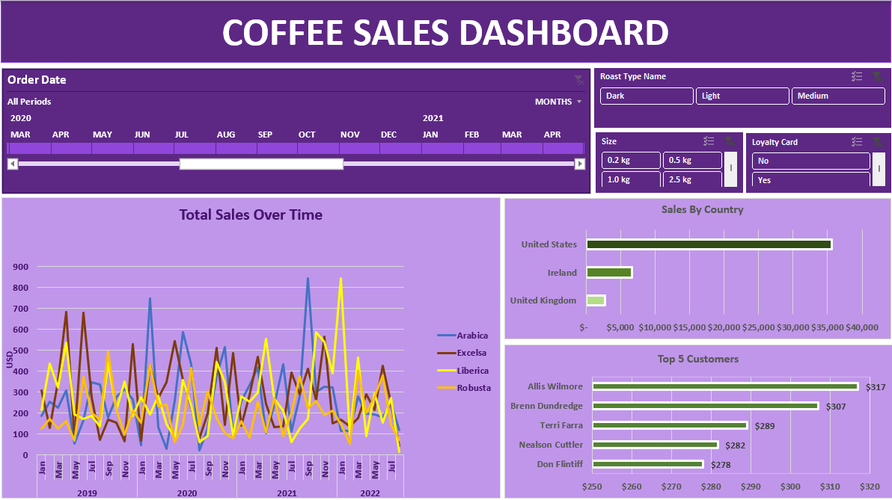
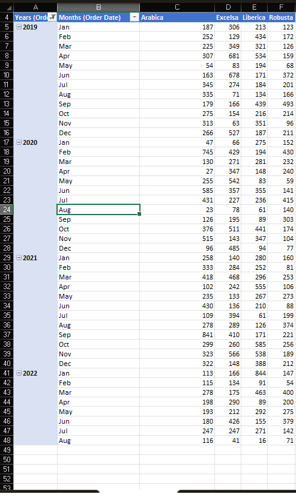
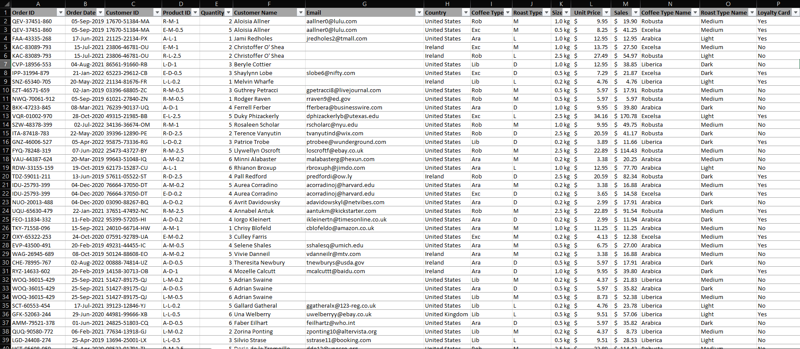

Coffee Sales Order Analysis

📊 Project Overview

This project provides a detailed analysis of coffee sales orders using Excel, featuring an interactive dashboard, pivot table, and insightful visualizations to highlight key metrics such as Order date,Total sales over time, top 5 customers, sales by country, coffee sizes, Loyalty Card, and roast types Name.

🛠️ Features

Interactive Dashboard: Visualizes key metrics such as total sales over time, sales by country, top customers, and more.

Line and Bar Charts: Detailed visual breakdowns of sales data.

Data Filters: Include options for coffee sizes, roast types, and loyalty card selection.

📈 Key Insights

Top 5 Customers:

1. Allis Wilmore: $317

2. Brenn Dundredge: $307

3. Terri Farra: $289

4. Nealson Cuttler: $282

5. Don Flintiff: $278

Sales by Country:

United States: Highest purchase volume.

Ireland: Second highest.

United Kingdom: Third.

Coffee Sizes Available:

0.2 kg

0.5 kg

1.0 kg

2.5 kg

Coffee Roast Types:

Dark

Light

Medium

Loyalty Card: Indicated as "Yes" or "No" in the dataset.

Total Sales Over Time(coffee name):

Arabica: Blue line

Excelsa: Brown line

Liberica: Yellow line

Robusta: Golden yellow line

📁 Project Files

/Coffee_Sales_OrderTable.xlsx - The cleaned dataset used in the analysis.

/Coffee_Sales_Dashboard.xlsx - A detailed dashboard visualizations.

/Coffee_Sales_Raw-Data.xlsx - The Raw data used for this project

/top5customer.xlsx - These are the top 5 customers using pivot table

README.md – Project documentation.
# Coffee Sales Analysis Project

## Project Overview
This Project analyzes coffee dales data using Excel, featuring a dashboard, pivot tables, and data visualizations to uncover trends and performance metrics.

## Screenshots

### Dashboard
 – Screenshot of the completed dashboard.

### Pivot Table
 - Screenshot of the pivot sales by year.

### Order Table
 - Screenshot of the cleaned data.

💡 Tools Used

Microsoft Excel

Pivot Tables

Dashboards

Slicer

Data Cleaning

🌟 What I Learned

Designing dynamic dashboards to summarize sales data.

Extracting actionable insights using line and bar charts.

Structuring and organizing data for improved analysis.

📬 Let's Connect!

If you have feedback or questions, feel free to connect with me on:

GitHub

LinkedIn

Medium
